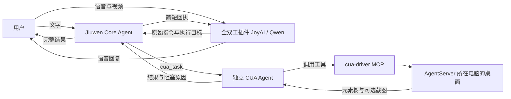
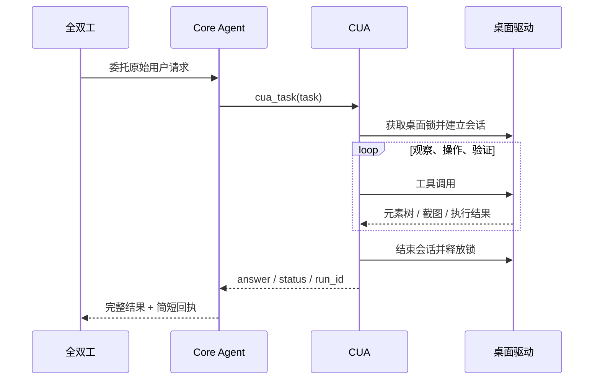

# 全双工 + CUA（实验分支）

CUA 为 Jiuwen Core Agent 提供桌面应用操作能力。普通对话和全双工委托共用
`cua_task`；网页操作继续使用原有浏览器能力。

2026-09-10 已合入 `Xiangyu` 的 `dac9611ba`，保留新版全双工任务队列控制、
文件结果回传及 JoyAI/Qwen 语音处理。Core SDK 跟随该版本固定到
`14a7fe2d0a2bf0cf2a25abd90f05f5ae6a9bf2d5`，CUA 无需单独切换 SDK 分支。



这里操作的是 **运行 AgentServer 的电脑**，不一定是打开网页的电脑。
全双工摄像头/共享屏幕帧与 CUA 桌面截图是两条独立输入链路。

## 安装与启用

在新分支的 Python 环境中安装 Jiuwen 原有依赖，再安装桌面驱动：

```powershell
python -m pip install "cua-driver==0.10.0"
cua-driver --version
cua-driver serve
```

驱动应运行在有桌面、已登录用户的交互会话中，保持窗口运行。
另开终端检查：

```powershell
cua-driver call get_screen_size
```

在 Jiuwen 实际使用的 `config.yaml` 中加入顶层配置；通常位于
`%USERPROFILE%\.jiuwenswarm\config\config.yaml`，以启动日志显示的路径为准：

```yaml
cua:
  enabled: true
  command: cua-driver
  capabilities: []                 # 先只观察桌面
  delivery_mode: background
  screenshot_multimodal: false
  snapshot_keep_last_k: 3
  max_iterations: 25
  timeout_s: 300
  tool_timeout_s: 60
  lock_wait_s: 30
```

保存后重启 AgentServer。普通 `agent` 模式自动注册工具；若使用 `code` 模式，
还需在原有 `modes.code.tools` 列表中 **追加** `cua_task`，保留其他条目。
新分支的默认模板已加入该条目。当前没有额外的 CUA 配置 UI。

驱动未加入 PATH 时，将 `command` 设为可执行文件的绝对路径；不要填写一整条 shell 命令。
默认 Windows 安装位置也会自动检测。

| 配置 | 含义 |
|---|---|
| `capabilities: []` | 列举应用、窗口、读取元素树等观察能力 |
| `capabilities: [input]` | 额外允许点击、键盘输入、滚动等 |
| `capabilities: [input, app_lifecycle]` | 再增加启动、置前、终止应用 |
| `delivery_mode: background` | 输入保持后台投递；不支持后台操作时报告限制 |
| `delivery_mode: foreground` | 允许输入通过前台窗口投递，会影响焦点 |
| `screenshot_multimodal: true` | 把截图交给模型；要求 Core Agent 的模型支持视觉与工具调用 |

CUA 复用 Core Agent 当前模型，不使用 JoyAI/Qwen Realtime 的音频连接推理桌面操作。
仅支持文字工具调用的模型应保持 `screenshot_multimodal: false`，通过元素树观察。
`delivery_mode` 只约束支持该参数的输入工具，不能阻止显式启用的 `bring_to_front`。

## 测试使用

先手动打开计算器，再在普通对话中说：

> 请使用 cua_task 查看计算器窗口的标题，不要点击或输入。

启用 `input` 后可测试：

> 请使用桌面工具在计算器中计算 23 × 17，并读取显示的结果。

然后在全双工里提出同一要求，确认以下链路都出现：



AgentServer 日志可搜索 `[CUA]` 和 `run=cua-`。每次调用记录开始、工具名称、
工具耗时及最终状态；完整结果沿 Jiuwen 原有工具结果链路返回。
CUA 工作目录在当前 Agent 工作目录的 `cua_runs/<run_id>/` 下，可能保存上下文卸载内容。

## 行为与边界

- 每次调用建立新的桌面会话和模型上下文；后续任务需要由 Core Agent 在 `task` 中补充必要信息。
- 同一操作系统用户的 Jiuwen CUA 任务共用桌面互斥锁，跨进程生效；其他软件或用户手动操作不受此锁控制。
- 超过等待时间返回 `busy`；执行超时返回 `timeout`。取消后清理连接、工具和锁，已执行的桌面动作不会回滚。
- 音频打断沿用全双工现有机制，**停止播放语音不等于取消正在执行的 CUA 操作**。
- 新版任务进度栏的“停止”通过 `CHAT_CANCEL` 请求 Core Agent 取消当前执行，等待 CUA 清理后确认；排队任务可调整顺序，抢先执行会先取消当前任务。取消并不撤销已执行动作，也不是暂停后恢复。
- MCP 权限错误原样进入工具结果。CUA 每次执行前按 Jiuwen 的全局、用户、会话合成规则读取当前有效权限，排队期间的权限变更也会生效；嵌套调用暂不提供交互式权限卡片，需要确认但无法确认的操作会被拒绝。
- `finished` 只表示模型正常结束本轮，`completion_verified: false` 不承诺任务已完成；Core Agent 应依据答案及桌面证据判断。
- 本次仅接入本机原生桌面能力，没有迁移 agent-core 的全部变更、持久 CUA resume 协议或浏览器 CDP 工具。

## 自动测试

```powershell
python -m pytest tests/unit_tests/cua -q -o addopts= -o log_cli=false
```

Python 3.13 下，固定版本 SDK 的浏览器模块存在 `invalid escape sequence`
警告；若被项目的严格警告策略升级为收集错误，可为此次测试追加
`-W "ignore:invalid escape sequence:SyntaxWarning"`。不需要修改 SDK 源码。

测试覆盖：能力范围、结构化 MCP 结果与截图、前后台投递、失败重复与快照保留、
桌面互斥、取消清理、Core Agent 嵌套调用及结果返回。
自动测试使用模拟模型和桌面服务；真实桌面成功率需按上述步骤另行验证。

2026-09-09 验证结果：CUA、Core Agent 配置重载、全双工任务队列共 100 项通过；
全双工 Core Agent 结果回传回归 5 项通过。MCP 协议测试启动真实子进程，
但使用测试服务替代桌面驱动；没有执行真实桌面操作。

2026-09-10 合并验证（分批运行，重复项不重复计数）：

| 验证范围 | 结果 |
|---|---|
| CUA、Core 配置重载、全双工全部后端测试 | 223 项通过 |
| JoyAI 语音流程、Qwen 打断、人声检测、任务界面 | 68 项通过 |
| 前端 TypeScript 检查与生产构建 | 通过 |
| CUA 代码及测试 Ruff 检查 | 通过 |

新增回归验证用户权限拒绝确实阻止桌面调用，以及“队列停止 → Core 任务取消 →
CUA 清理 → 停止确认”。取消测试使用真实队列、Core 取消方法及 CUA 执行器，
RPC 传输、模型与桌面驱动为模拟组件，不代表已完成真实桌面的急停验证。
测试环境另有 Authlib 弃用警告及 pytest 退出清理旧临时目录的权限提示，测试退出码为 0。

移植来源及与上游的差异见 [NOTICE](../../jiuwenswarm/agents/harness/cua/NOTICE.md)。
