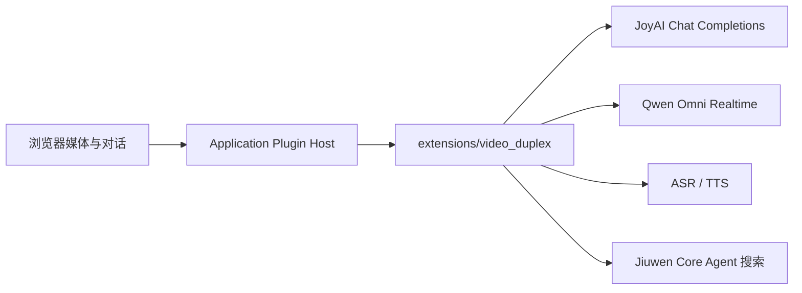
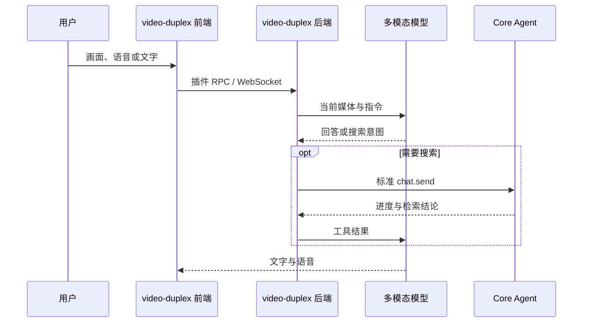
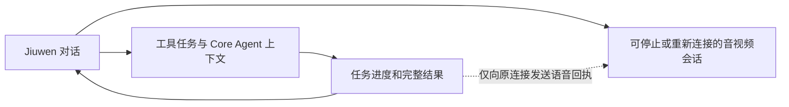

# 全双工视频插件

`video-duplex` 是 JiuwenSwarm 的全栈 Application Plugin。摄像头、共享屏幕、
麦克风、模型协议、ASR/TTS 和搜索编排均位于本插件目录；Jiuwen 核心只提供通用的
插件发现、页面挂载、RPC/WebSocket 路由和 Core Agent 服务注入。



## 启用与配置

优先在 Jiuwen 侧栏打开 **扩展 → 应用插件 → Full-duplex → 设置**。配置表单、字段显示、
密钥占位和保存逻辑均由 `video-duplex` 插件提供；核心前端只负责发现并挂载该组件。
禁用插件后，全双工功能入口会隐藏，但 **扩展 → 应用插件** 中的设置入口仍保留，可用于重新启用。

实例配置文件：

- Windows：`%USERPROFILE%\.jiuwenswarm\config\.env`
- macOS/Linux：`~/.jiuwenswarm/config/.env`

在设置页保存后，新请求会直接使用最新配置。手动修改 `.env` 时需要重启 Gateway。
`VIDEO_DUPLEX_ENABLED=false` 会禁用插件并隐藏全双工侧栏入口。

### JoyAI + OpenAI 兼容 ASR/TTS

```dotenv
VIDEO_DUPLEX_ENABLED=true
VIDEO_LIVE_MODE=joyai
JOYAI_API_BASE=https://modelservice.jdcloud.com/v1
JOYAI_API_KEY=pk-your-key
JOYAI_MODEL_NAME=jdopensource/JoyAI-VL-Interaction

VOICE_PROTOCOL=openai_http
VOICE_ASR_ENDPOINT=https://api.siliconflow.cn/v1/audio/transcriptions
VOICE_TTS_ENDPOINT=https://api.siliconflow.cn/v1/audio/speech
VOICE_API_KEY=sk-your-key
VOICE_ASR_MODEL=FunAudioLLM/SenseVoiceSmall
VOICE_TTS_MODEL=FunAudioLLM/CosyVoice2-0.5B
VOICE_TTS_VOICE=FunAudioLLM/CosyVoice2-0.5B:anna
```

`JOYAI_API_BASE` 填到 `/v1`，不要填到 `/chat/completions`。JoyAI 视觉模型不直接
处理麦克风或生成语音，因此必须配置独立 ASR/TTS。

如使用 JoyAI 原生语音 WebSocket：

```dotenv
VOICE_PROTOCOL=native_ws
VOICE_ASR_ENDPOINT=ws://127.0.0.1:8994/ws/asr
VOICE_TTS_ENDPOINT=ws://127.0.0.1:8992/ws/tts
```

### Qwen Omni Realtime

```dotenv
VIDEO_DUPLEX_ENABLED=true
VIDEO_LIVE_MODE=realtime
VIDEO_REALTIME_PROVIDER=qwen_omni
QWEN_OMNI_REALTIME_URL=wss://your-workspace.example.com/api-ws/v1/realtime
QWEN_OMNI_API_KEY=sk-your-key
QWEN_OMNI_MODEL_NAME=qwen3.5-omni-flash-realtime
QWEN_OMNI_VOICE=Cherry
```

浏览器连接 Jiuwen Gateway 的 `/ws/video/qwen-omni`，上游地址和密钥只留在服务端。

## 运行流程



| 能力 | JoyAI | Qwen Omni Realtime |
|---|---|---|
| 模型连接 | 逐帧 Chat Completions | 持久 WebSocket |
| 语音 | 独立 ASR/TTS | 模型原生音频 |
| 搜索触发 | 模型 delegation | function call |
| 搜索执行 | Jiuwen Core Agent | Jiuwen Core Agent |
| 打断 | 停止独立 TTS | `response.cancel` |

## 使用与验证

1. 启动 Jiuwen，侧栏进入 **Full-duplex**。
2. 选择摄像头、共享屏幕或本地视频并授予权限。
3. 用语音或文字提问，确认文字、语音和打断正常。
4. 对需要外部信息的问题，确认搜索进度和最终回答均返回。
5. 在 **扩展 → 应用插件** 中禁用，确认全双工入口隐藏，但管理页仍可重新启用。

日志位于 `~/.jiuwenswarm/logs/`：

| 文件 | 内容 |
|---|---|
| `joyai-video.jsonl` | 帧请求、原始结果、延迟和限流 |
| `asr-results.jsonl` | 转写、空结果、噪音过滤和延迟 |
| `video-task-routing.jsonl` | 搜索、TTS 和工具调用 |
| `realtime-interrupt.jsonl` | Realtime 状态与打断 |

## 任务页中的停止与重连

任务页将 **Jiuwen 对话与工具任务**、**音视频连接** 分开管理：



- 停止全双工会释放媒体资源，不取消已提交的 Core Agent 任务。
- 同一对话再次启动时沿用工具会话标识；切换对话会使用另一组工具上下文。
- 已提交任务继续接收推送并定期查询状态，完整结果独立显示并写入原对话历史；重复推送不会重复插入结果。
- 旧连接的 Qwen `call_id` 不会交给新连接。停止期间完成的结果只显示文字，不会在重连后自动补播。

这一步不恢复 Qwen/JoyAI 的模型对话历史，也不包含浏览器刷新、页面卸载或后端重启后的未完成任务恢复；任务追踪目前保存在任务页运行时中。

验证：在前端目录执行 `npm run test:task-full-duplex` 和 `npm run test:qwen-barge-in`。人工验证可提交一个耗时任务，停止全双工，确认任务仍完成并显示结果；再启动后提交关联请求，确认沿用同一工具上下文。

## 手动调整委托任务

任务页右侧的「进度」中，Qwen 与 JoyAI 共用任务控制：等待任务可拖到另一项前面，也可使用「设为下一项」或菜单中的上移、下移；点击停止按钮可取消等待任务或停止执行中的任务。菜单的「停止当前任务并执行此项」会先请求 Jiuwen Core Agent 停止当前任务，确认后再执行所选任务，不会关闭音视频连接。

「正在停止」表示尚未确认终止；失败时显示错误并保留实际状态。停止记录、已有回答和文件产物仍保留，已经完成的外部操作不会回滚。队列顺序由后端确认，过期的调整请求会被拒绝并刷新。取消结果会结束 Qwen 对应的工具调用，但不会触发新的语音播报。

这些操作针对整项 Core Agent 委托，不重排任务内部工具步骤；不提供暂停后原地恢复，也不自动推断任务依赖，请将依赖前置产物的任务排在其后。页面卸载和后端重启后的队列恢复仍不包含在内。

验证：`npm run test:task-full-duplex`（前端目录）；`python -m pytest jiuwenswarm/extensions/video_duplex/tests/backend/test_video_task_queue.py`（仓库根目录）。

## 代码入口

任务页的产物沿用 Jiuwen 原生文件链路：Core Agent 使用 `send_file_to_user` 返回文件 → 全双工转发 `chat.file` → 原对话 `fileItems` → 产物列表、预览和下载。文件事件会单独保存为 `chat.file` 历史，重新打开对话后可恢复。停止全双工不阻止已知任务的文件返回；仅在回答中写路径或代码块不会自动生成文件产物。

内部 `video_tool` 渠道默认继承 `channels.web.send_file_allowed`；若显式配置 `channels.video_tool.send_file_allowed`，则使用该值。文件的原始路径、下载地址和令牌直接复用原生工具结果，不重新签发令牌或变更文件访问权限。

| 职责 | 文件 |
|---|---|
| 插件注册与贡献 | `extension.py`、`extension.yaml` |
| 插件设置页面 | `frontend/VideoDuplexSettings.tsx` |
| 插件设置持久化 | `backend/settings.py` |
| 页面 | `frontend/VideoLivePanel/index.tsx` |
| 任务归属与结果去重 | `frontend/taskDuplexJobs.ts` |
| 任务页结果订阅、恢复与持久化 | `frontend/TaskFullDuplexRuntime.tsx` |
| JoyAI 调度 | `frontend/VideoLivePanel/joyaiProvider.ts` |
| Qwen 会话 | `frontend/VideoLivePanel/qwenOmniSession.ts` |
| 后端编排 | `backend/video_live.py` |
| ASR/TTS | `backend/video_voice.py` |
| 搜索 | `backend/video_search.py` |
